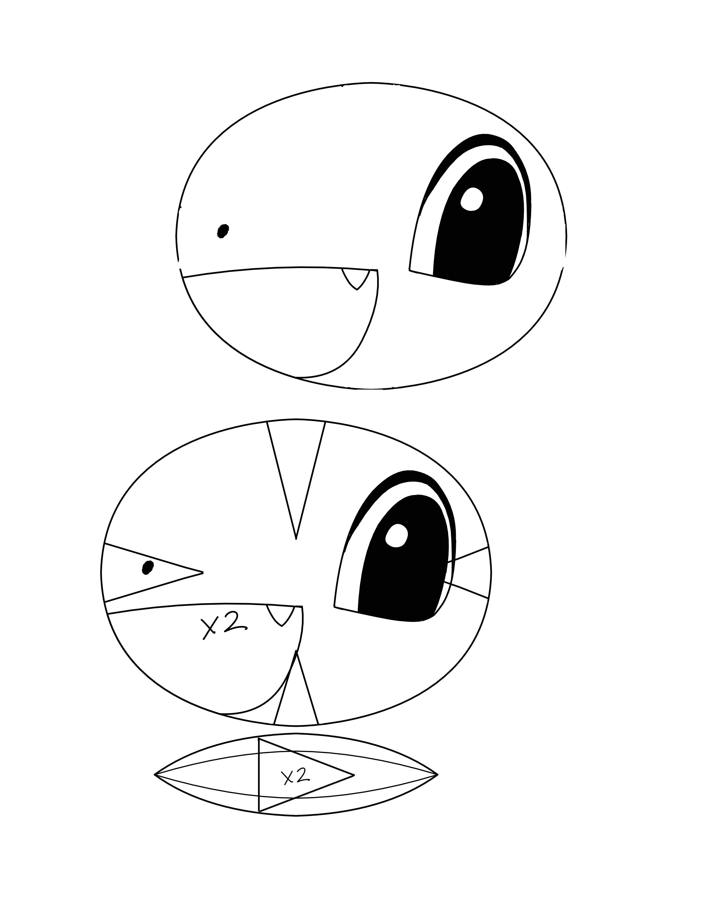
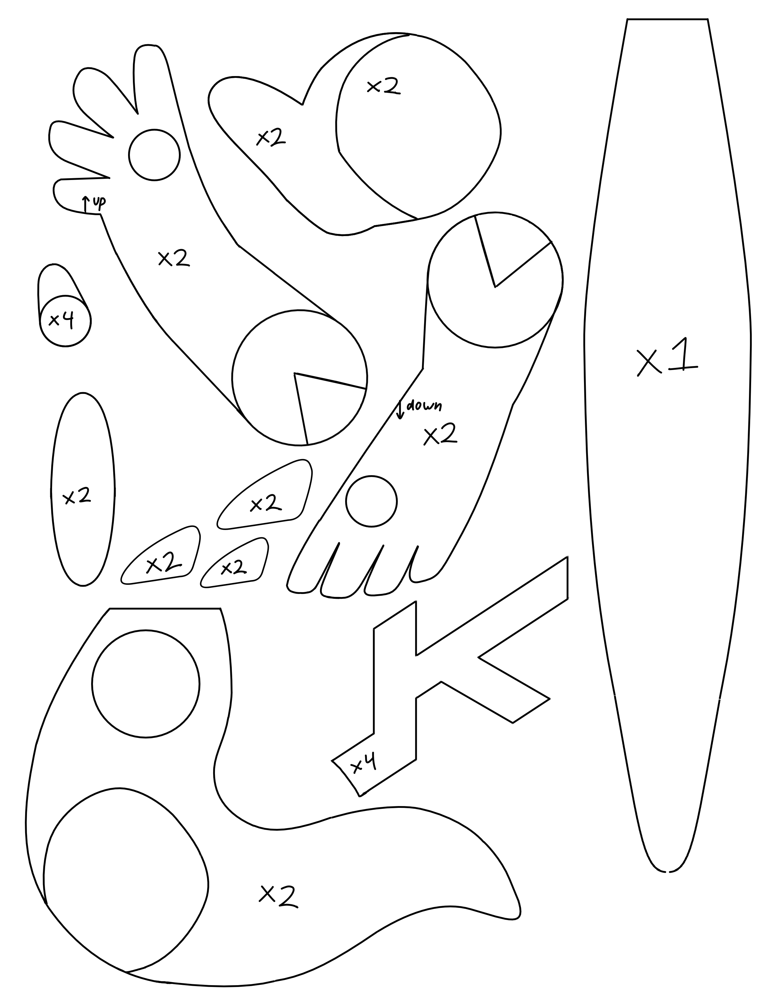
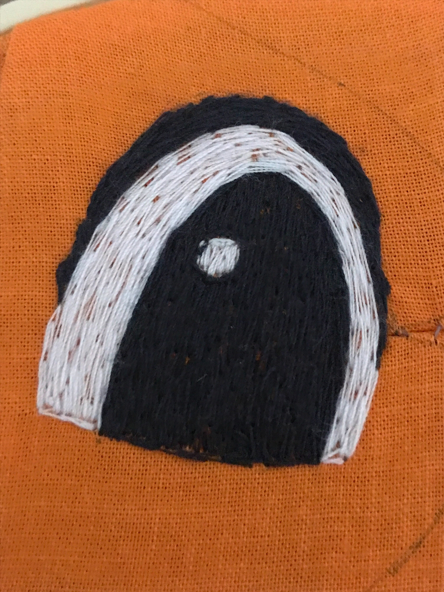
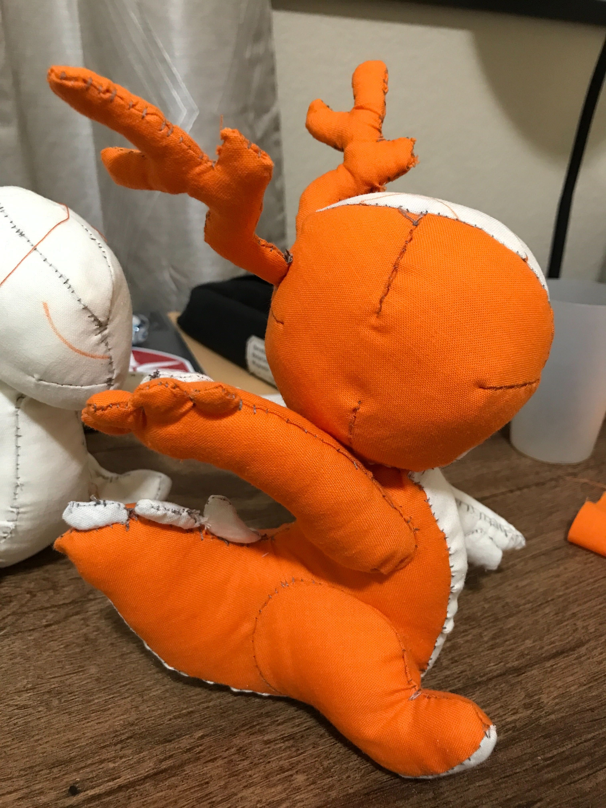
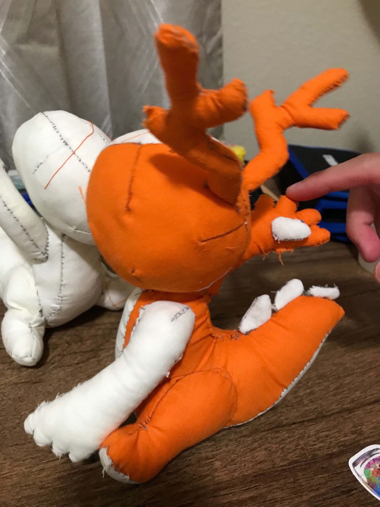

# konqi plush
making a hand sewn plush version of KDE's mascot, konqi
(for my very awesome friend!!!)
pattern made by me, no machines were used except for my computer running krita

## prototype 4: patterns

## prototype 4: testing embroidery

## prototype 3: finished

